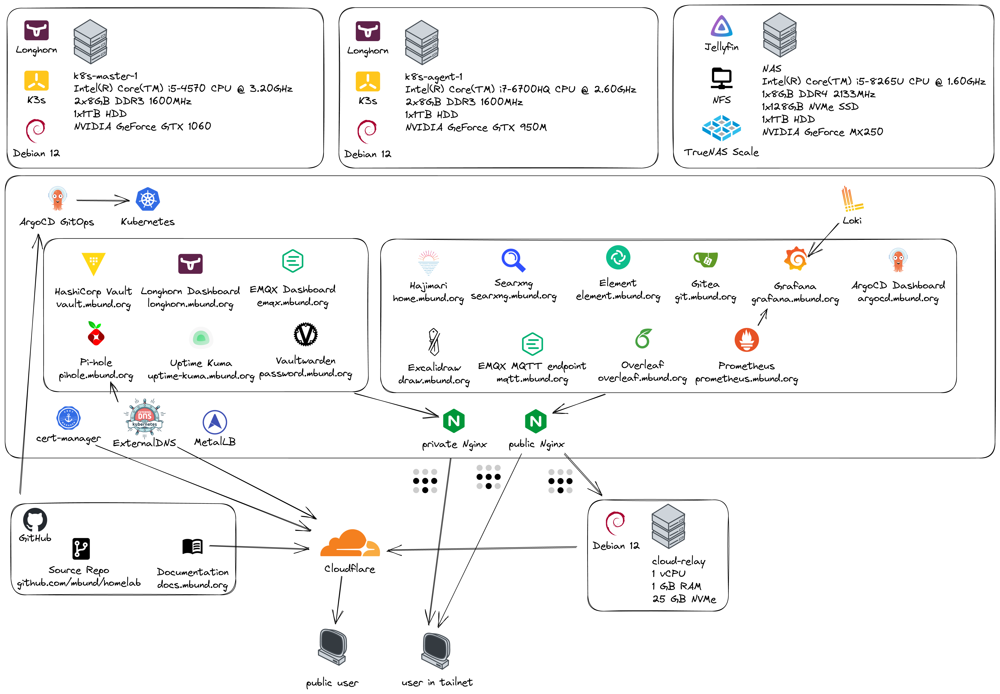
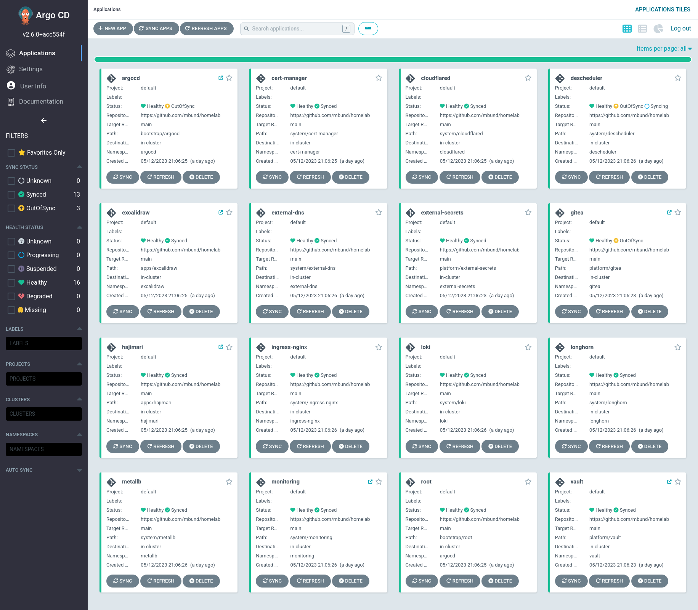
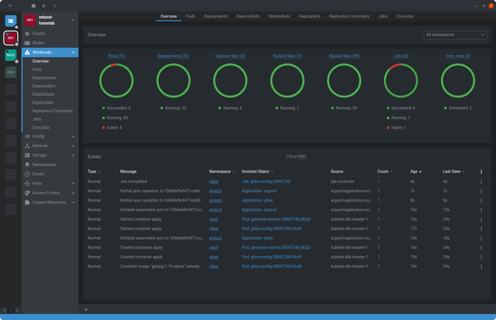
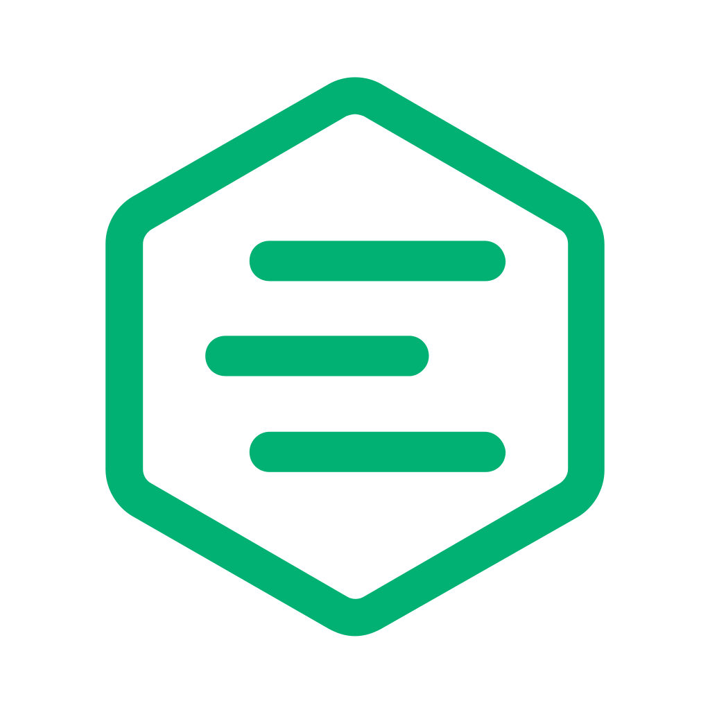

# Mark's Homelab :sailboat:

Fully automated Kubernetes and GitOps setup to host my important services at home.

Read the [docs](https://docs.mbund.org) for technical details.

## Live Stats

<table>
<tr>
    <td>argocd</td>
    <td></td>
    <td>cert-manager</td>
    <td></td>
</tr>
<tr>
    <td>element</td>
    <td></td>
    <td>emqx</td>
    <td></td>
</tr>
</table>

## Architecture

## Hardware

  
  
Scuffed homelab. Laptop on left runs Proxmox/Kubernetes, desktop on right runs bare Ubuntu Server and is not a part of the cluster.

- Dell Inspiron 7580
    - CPU: `8 x Intel(R) Core(TM) i5-8265U CPU @ 1.60GHz`
    - RAM: `8GB`
    - SSD: `128GB`
    - HDD: `1TB`

- Dell XPS 8700 (depicted in image but not used)
    - CPU: `8 x Intel(R) Core(TM) i7-4790 CPU @ 3.60GHz`
    - RAM: `8GB`

## Screenshots

| ArgoCD |
| :--: |
|  |

| Lens |
| :--: |
|  |

## Apps

<table>
    <tr>
        <th>Logo</th> <th>Name</th> <th>Description</th>
    </tr>
    <tr>
        <td>
        <td><a href="https://hajimari.io">Hajimari</a></td>
        <td>Simplistic startpage for Kubernetes services</td>
    </tr>
    <tr>
        <td>
        <td><a href="https://docs.excalidraw.com">Excalidraw</a></td>
        <td>Online whiteboard</td>
    </tr>
    <tr>
        <td>
        <td><a href="https://github.com/louislam/uptime-kuma">Uptime Kuma</a></td>
        <td>Service uptime checker</td>
    </tr>
    <tr>
        <td>
        <td><a href="https://searxng.org">Searxng</a></td>
        <td>Metasearch engine</td>
    </tr>
    <tr>
        <td>
        <td><a href="https://element.io">Element</a></td>
        <td>Matrix web client</td>
    </tr>
    <tr>
        <td>
        <td><a href="https://github.com/dani-garcia/vaultwarden">Vaultwarden</a></td>
        <td>Bitwarden compatible password manager</td>
    </tr>
    <tr>
        <td>
        <td><a href="https://overleaf.com">Overleaf</a></td>
        <td>Online Latex collaborative studio</td>
    </tr>
    <tr>
        <td>
        <td><a href="https://emqx.io">EMQX</a></td>
        <td>MQTT broker</td>
    </tr>
        <tr>
        <td>
        <td><a href="https://gitea.io">Gitea</a></td>
        <td>Self hosted git server</td>
    </tr>
</table>
