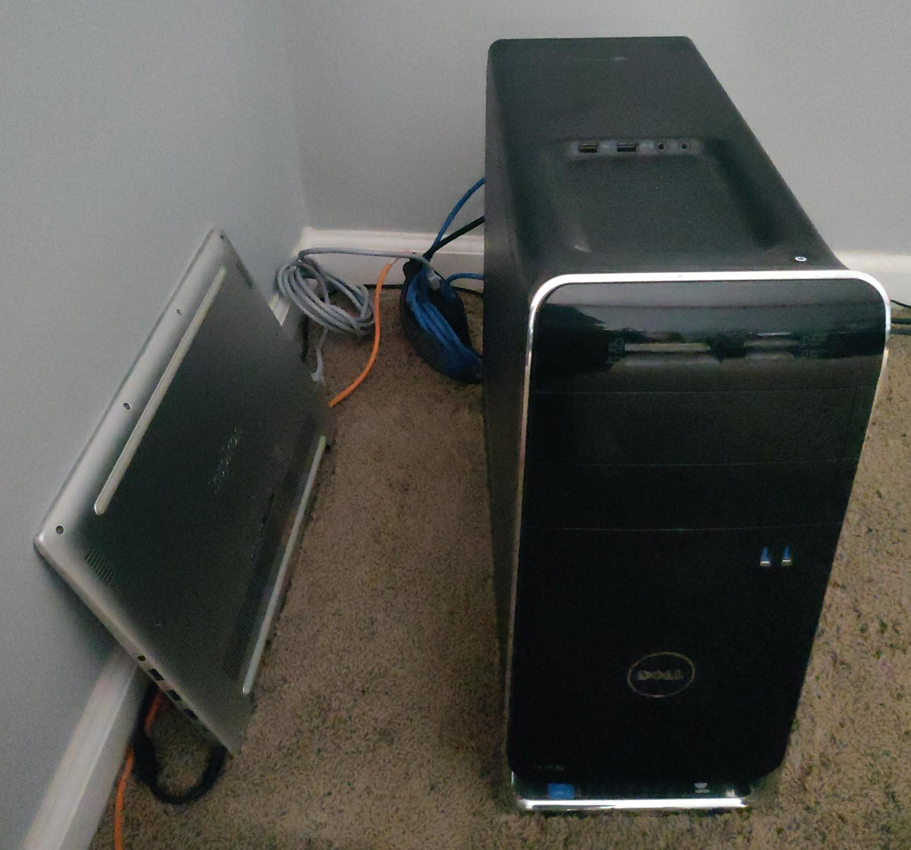

# Mark's Homelab :sailboat:

Fully automated Kubernetes and GitOps setup to host my important services at home.

Read the [docs](https://mbund.github.io/homelab) for technical details.

### Hardware

  
  
Scuffed homelab. Laptop on left runs Proxmox/Kubernetes, desktop on right runs bare Ubuntu Server and is not a part of the cluster.

- Dell Inspiron 7580
    - CPU: `8 x Intel(R) Core(TM) i5-8265U CPU @ 1.60GHz`
    - RAM: `8GB`
    - SSD: `128GB`
    - HDD: `1TB`

- Dell XPS 8700 (depicted in image but not used)
    - CPU: `8 x Intel(R) Core(TM) i7-4790 CPU @ 3.60GHz`
    - RAM: `8GB`

## Apps

<table>
    <tr>
        <th>Logo</th> <th>Name</th> <th>Description</th>
    </tr>
    <tr>
        <td>
        <td><a href="https://hajimari.io">Hajimari</a></td>
        <td>Simplistic startpage for Kubernetes services</td>
    </tr>
    <tr>
        <td>
        <td><a href="https://docs.excalidraw.com">Excalidraw</a></td>
        <td>Online whiteboard</td>
    </tr>
</table>
